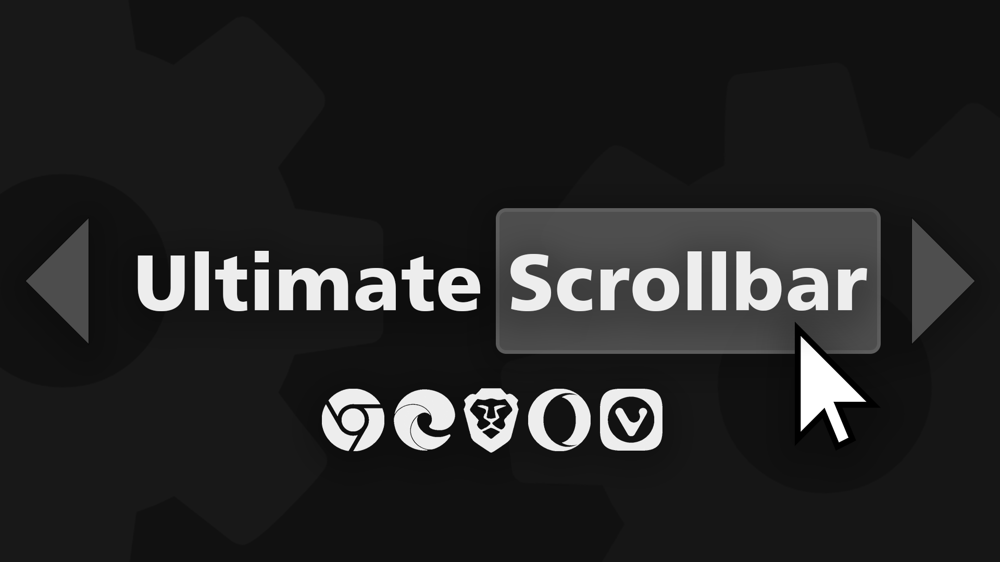

  <h1>Ultimate ScrollBar</h1>
  

 
(To install this style you need a <a href="https://github.com/openstyles/stylus#stylus">stylus extension</a>)

 

Features:
- Set custom colors
- Set custom sizes
- Set rounded corners
- Separate theme for websites with dark mode
- Option to change main scrollbar only
- Don't change the size of the scrollbar on zoom (ctrl +)
- Check all the options in the config menu ⚙️

How to:
- [Exclude web pages](https://github.com/pabli24/ultimate-scrollbar/wiki#how-to-exclude-web-pages)
- [Enable 'Patch CSP to allow style assets'](https://github.com/pabli24/ultimate-scrollbar/wiki#how-to-enable-patch-csp-to-allow-style-assets)
